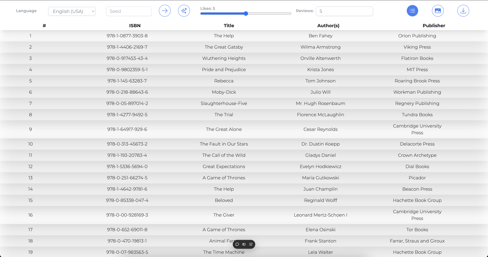
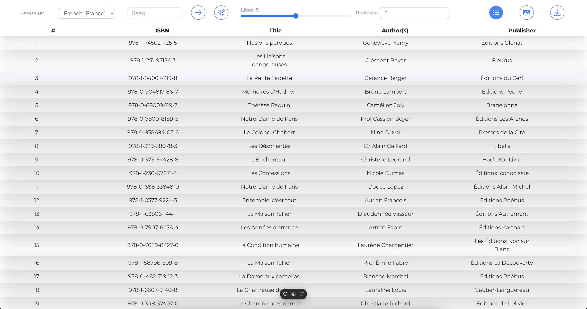
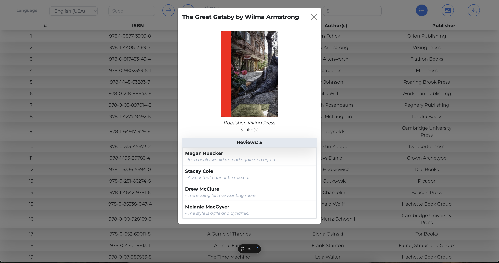
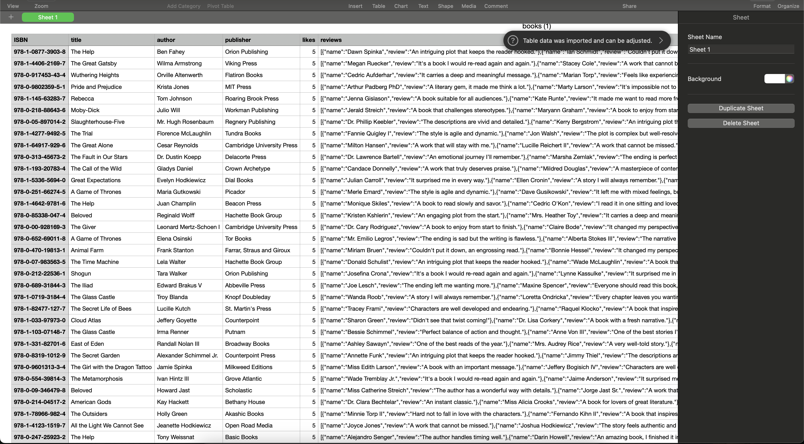

# Bookify: ITransition Task #5

## Description

This project is a web application built with **TailwindCSS**, **Next.js**, **Node.js**, **Vercel**, and **React Bootstrap**. It allows users to load, view, and search books based on likes, reviews, region, and more. The app also supports selecting a random seed for generating book recommendations.

### Deployed Page: https://itransition-bookify.vercel.app/
### Video: https://youtu.be/99Vxg8Qtm9w

## User Stories

### 1. **Loading New Books**
- **As a user**, I want to be able to load new books so that I can explore the latest additions to the collection.
### 2. **Viewing Book Details**
- **As a user**, I want to be able to click on a book and view its detailed information so that I can learn more about it before deciding whether to read or purchase it.

### 3. **Searching for Books by Likes**
- **As a user**, I want to be able to search for books based on their number of likes so that I can find the most popular books.

### 4. **Searching for Books by Reviews**
- **As a user**, I want to be able to search for books based on their reviews so that I can find books with more reviews.

### 5. **Changing Region**
- **As a user**, I want to be able to change the region of the books displayed so that I can see books relevant to my location or region.

### 6. **Selecting a Random Seed**
- **As a user**, I want to be able to select a random seed to generate different book recommendations, so I can explore new books that I might not have come across otherwise.

## Screenshots

## About Tech Stack

This is a project built with the following technologies:

- **[TailwindCSS](https://tailwindcss.com/)**: A utility-first CSS framework for creating custom designs quickly.
- **[Next.js](https://nextjs.org/)**: A React framework for building server-side rendered and statically generated web applications.
- **[Node.js](https://nodejs.org/)**: A JavaScript runtime built on Chrome's V8 JavaScript engine for building fast and scalable network applications.
- **[Vercel](https://vercel.com/)**: A platform for frontend developers to build, preview, and ship websites.
- **[React Bootstrap](https://react-bootstrap.github.io/)**: A library of reusable front-end components that integrates with React and Bootstrap.

